Date-04-2025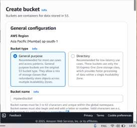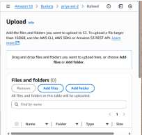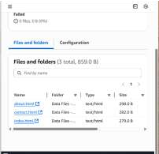

Task-AWS (Presented by Priya Jha) S3 Bucket Creation & Public Access
Notes : **Step** **1:** **Create** **an** **S3** **Bucket**

> 1\. Go to **S3**in AWS Console,Then Click **Create** **bucket**.
>
> 2\. Enter **Bucket** **Name(priya-exl)**& choose **Region**(by default
> it is Mumbai as selected previously).
>
> 3\. Uncheck **“Block** **all** **public** **access”**.
>
> 4\. Acknowledge warning → Click **Create** **bucket**.
>
> Then add objects:

**Step** **2:** **Make** **Bucket** **Public** **(for** **Object**
**Access)**

> 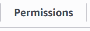 style="width:0.94714in;height:0.325in" />1. Go to your bucket
> →**Permissions**tab.

Date-04-2025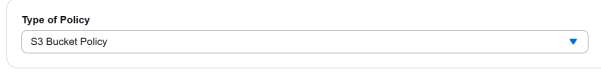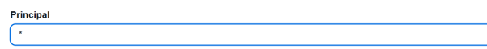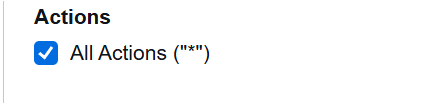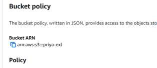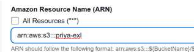

> 2\. Click **Bucket** **Policy**→ Click **Edit**.
>
>  style="width:1.22122in;height:0.57847in" />3. Then
>
> 4\. In generate steps we need to fill some details:
>
> For all type of permissions (Get ,put, delete, update etc)
>
> Please copy this Bucket ARN from here and paste it into Amazone
> Resource Name(ARN)
>
> …………………………………………………………………………………………..
>
>  style="width:1.85347in;height:0.81597in" />Then

Date-04-2025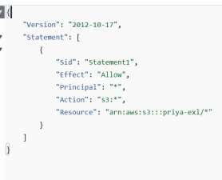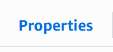

> 5\. Add below policy to allow public access to **objects**:
>
> After it save changes (done forget to check /\* after your bucket
> name.)
>
> This makes**objects** **public**, not the bucket itself.

**Step** **3:** **Enable** **StaticWebsite** **Hosting**

> 1\. Go to **Properties**tab in the bucket.
>
> 2\. Scroll to **Static** **website** **hosting**→ Click**Edit**.
>
> 3\. Select **“Enable”**.
>
> 4\. Set:
>
> **Index** **document**: index.html
>
> (Optional)**Error** **document**: error.html
>
> 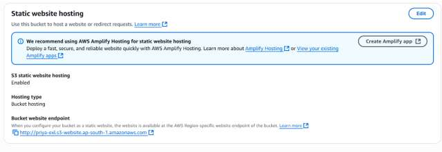 style="width:6.65764in;height:2.31097in" />5. Click**Save**
> **changes**.

Date-04-2025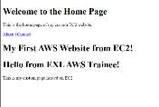

> Results:afterpasting the link In the browser.

Key points:

Static website hosting gives you a **website** **endpoint**like:
http://priya-exl.s3-website.ap-south-1.amazonaws.com

> That URL only works if:
>
> • weenabled statichosting.
>
> • We willadd a valid **public-read** **bucket** **policy**.
>
> • The uploaded files (like index.html) are accessible.

Step-by-Step: Launch and Set Up EC2 Instance (EXL Dashboard)

**Step1.** **Go** **toEC2** **Dashboard**

> • Open AWS Console → Search for**EC2**.
>
> • Click on**“EC2”**under Services.

**Step** **2.** **Launch** **an** **Instance**

> • Click **"Launch** **Instance"**.
>
> 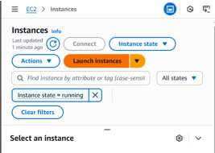 style="width:2.79097in;height:1.98889in" />•
>
> • Enter:
>
> o **Name**: priya-exl-apache2

Date-04-2025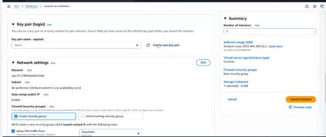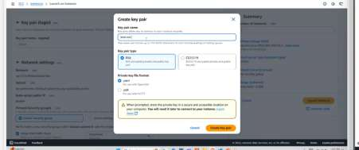

**Amazon** **Machine** **Image** **(AMI)**: Select **Ubuntu** **Server**
**22.04** **LTS**(recommended).

**Instance** **type**: Choose t2.micro (Free Tier eligible).

**Key** **pair**: Create or select an existing one
(prita-exl-apache2.pem).

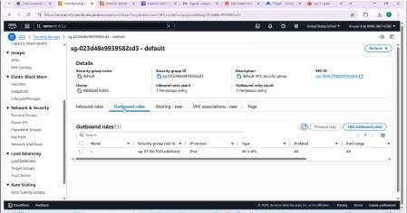**Network** **settings**:

Date-04-2025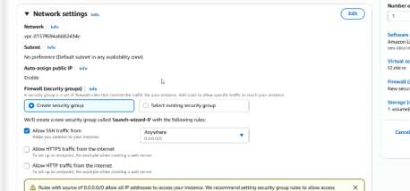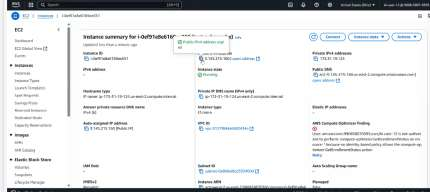

Add **HTTP** **(port** **80)**and optionally **HTTPS** **(port**
**443)**if using Apache

> • Click **Launch** **Instance**.
>
> • Now connect towsl:
>
> 1\. Added key-pair file into .ssh. 2. Come into ssh directory

Date-04-2025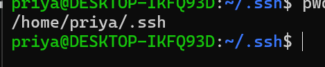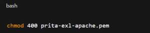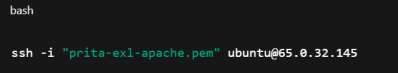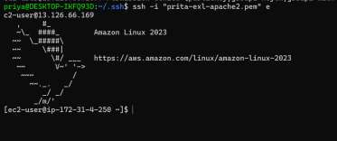

Put this command to convert remove rw operation to read operation:

Then configure the instance to wsl ubuntu.

> This Chiriya(Bird kind of structure) means itis connected to aws.

**Step3.** **View** **InstanceDetails**

> • Go to **“Instances”**tab.
>
> • Note the **Public** **IPv4address**(e.g., 65.0.32.145).

Check if Apache is Running

**Open** **Apache** **Web** **Page** **in** **Browser**

> • Open your browser.
>
> • Go to:
>
> http://\<your-public-ip\>

Example: http://65.0.32.145

You should see the **Apache2** **Ubuntu** **Default** **Page**. This
confirms Apache is working.

**3.** **Upload** **Your** **Website** **Files** **(Optional)**

Apache serves content from:

To replace the default page:

Date-04-2025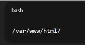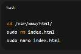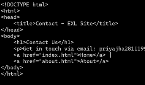

**4.** **Allow** **HTTP** **Access** **in** **EC2** **(if** **not**
**done)**

Go to:

> • AWS Console → **EC2** **Dashboard**
>
> • Select your instance → **Security** **groups**
>
> • Edit **inbound** **rules**:
>
> o Add **HTTP**(port 80)
>
> o Add **HTTPS**(port 443)–optional
>
> o Add **Custom** **TCP** **22**(SSH)

Some results after setting up these all :

Step-by-Step: Install & Set Up MySQL on Ubuntu EC2

Connect to your EC2 instance

ssh -i "prita-exl-apache.pem"
[<u>ec2-user@65.0.32.145</u>](mailto:ec2-user@65.0.32.145)

Then:

Install MySQL Server

Bash command:sudo apt install mysql-server -y

Date-04-2025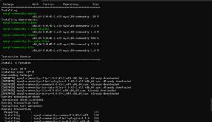

Start & Enable MySQL Service

Bash command:

sudo systemctl start mysql

sudo systemctl enable mysql

Loginto MySQL shell

sudo mysql→mysql\>(shell)

Now start working on Aurora and RDS(Create Database)

> 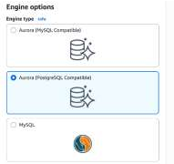 style="width:1.99292in;height:1.87917in" />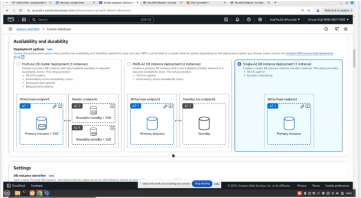 style="width:3.76583in;height:2.06944in" />Choose MySQ

Date-04-2025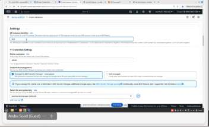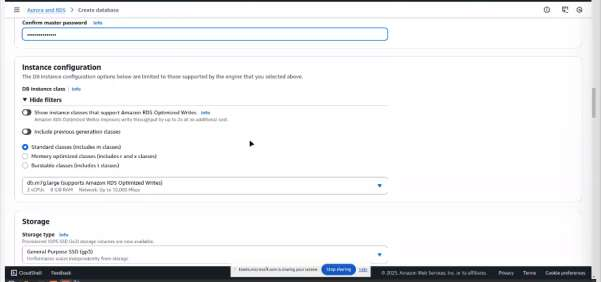

Our user: Admin

Create Password : ExlDatabase123

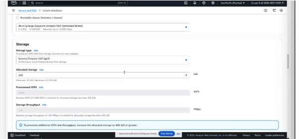Allocate storage :

Date-04-2025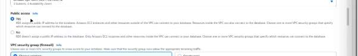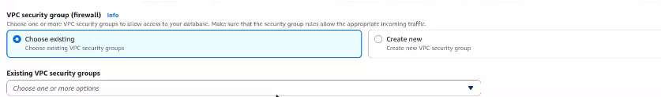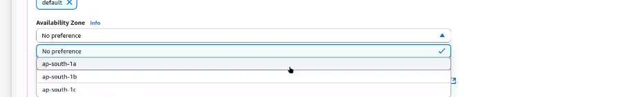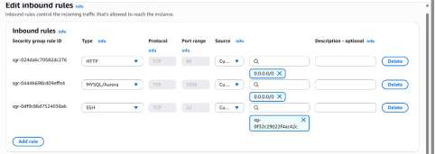

Public access : Yes

Choose vpc: created by you or default.

Choose Zone availability

Now data base created:

Check Inbound:

Correct……..

Nowwork onwsl:

mysql connectedto awsandwsl

Date-04-2025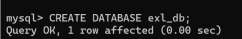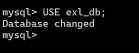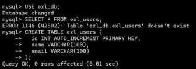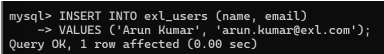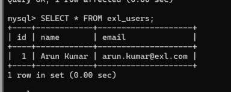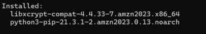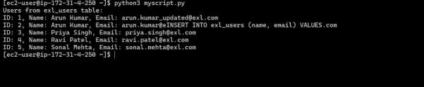

BasicDatabasecreationandmanipulationcommands:

Nowinstall Pythonandthenrunanscriptto checka databaseconnection.

PythonInatallation:

Thisisfinal outputwhichshowsdatabaseconnectedsuccessfully:

Thisisend.

Thank you!
